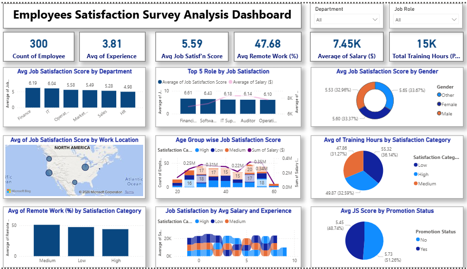

# 📊 Employee Satisfaction Analysis – Power BI

An interactive **Employee Satisfaction Analysis Dashboard** developed using **Microsoft Power BI** to analyze employee satisfaction, performance, workplace factors, and HR-related trends.

The project uses an HR employee performance dataset and transforms the data into an interactive dashboard that can help HR teams understand employee experience and identify areas that may require attention.

## 📌 Project Overview

Employee satisfaction plays an important role in employee engagement, productivity, and retention.

This project analyzes employee-related data using **Power BI** to identify patterns and relationships between employee satisfaction, job-related factors, performance, and workplace conditions.

The dashboard provides an interactive way to explore the data through visualizations, filters, and key performance indicators.

## 🎯 Objectives

The main objectives of this project are:

* Analyze overall employee satisfaction.
* Identify factors associated with employee satisfaction.
* Compare satisfaction levels across different employee groups.
* Analyze employee performance in relation to satisfaction.
* Explore workplace and job-related satisfaction indicators.
* Present HR data through interactive visualizations.
* Provide insights that can support data-driven HR decisions.

## ✨ Key Features

### 📊 Employee Satisfaction Dashboard

The Power BI dashboard provides interactive visualizations for exploring employee satisfaction and related HR metrics.

### 👥 Employee Analysis

Analyze employee information and compare satisfaction and performance across different employee segments.

### 💼 Job Satisfaction Analysis

Explore how employees rate their satisfaction with their current jobs and identify patterns across different categories.

### 🏢 Workplace & Environment Analysis

Analyze employee satisfaction related to their working environment and organizational conditions.

### ⚖️ Work-Life Balance

Examine employee work-life balance ratings and their relationship with other employee-related factors.

### 📈 Performance Analysis

Compare employee performance ratings with satisfaction-related indicators to identify possible relationships between performance and employee experience.

### 🔍 Interactive Filtering

Power BI filters and interactive visuals allow users to explore specific employee groups and satisfaction categories.

## 🧰 Tools & Technologies

| Tool / Technology             | Purpose                                 |
| ----------------------------- | --------------------------------------- |
| **Microsoft Power BI**        | Dashboard development and visualization |
| **Power Query**               | Data cleaning and transformation        |
| **DAX**                       | Measures and analytical calculations    |
| **Microsoft Excel**           | Source dataset                          |
| **Power BI Template (.pbit)** | Reusable dashboard template             |

## 📂 Repository Contents

```text
employeeSatisfaction-powerBI/
│
├── Employee_Satisfaction_Analysis.pbit
│   └── Power BI dashboard template
│
├── Employee_Satisfaction_Survey_Analysis_IMG.png
│   └── Dashboard preview/screenshot
│
├── HR_Employee_Performance_Dataset.xlsx
│   └── Source HR employee dataset
│
└── README.md
    └── Project documentation
```

These files are currently present in the repository.

## 📊 Dashboard Analysis

The dashboard focuses on multiple aspects of employee experience and performance, including:

* Employee satisfaction
* Job satisfaction
* Environment satisfaction
* Relationship satisfaction
* Work-life balance
* Employee performance
* Training-related factors
* Employee demographics and organizational information

The analysis can be used to identify patterns in employee feedback and understand which areas may require improvement.

## 🔄 Data Analysis Workflow

```text
HR Employee Dataset
        │
        ▼
Data Import
        │
        ▼
Data Cleaning & Transformation
        │
        ▼
Power Query
        │
        ▼
Data Modeling
        │
        ▼
DAX Measures & Calculations
        │
        ▼
Interactive Visualizations
        │
        ▼
Employee Satisfaction Dashboard
        │
        ▼
HR Insights & Decision Support
```

## 📈 Dashboard Preview

Add the dashboard screenshot below:

```markdown

```

The repository already contains the dashboard image that can be used as the preview.

## 🚀 How to Use

### 1. Clone the Repository

```bash
git clone https://github.com/rahulrajyada/employeeSatisfaction-powerBI.git
```

Navigate to the project folder:

```bash
cd employeeSatisfaction-powerBI
```

### 2. Open the Power BI Template

Open:

```text
Employee_Satisfaction_Analysis.pbit
```

using **Microsoft Power BI Desktop**.

### 3. Load the Dataset

If Power BI asks for the data source, select:

```text
HR_Employee_Performance_Dataset.xlsx
```

### 4. Explore the Dashboard

Once the data is loaded, users can interact with the dashboard using:

* Filters
* Slicers
* Charts
* Tables
* KPIs
* Interactive visualizations

## 💡 Key Skills Demonstrated

This project demonstrates practical skills in:

* Power BI
* Data Analysis
* Data Visualization
* Power Query
* Data Cleaning
* Data Transformation
* DAX
* Dashboard Design
* HR Analytics
* Business Intelligence
* Excel Data Analysis
* Interactive Reporting

## 🎓 Learning Outcomes

Through this project, I gained practical experience in:

1. Importing and preparing real-world HR data.
2. Cleaning and transforming datasets using Power Query.
3. Creating relationships and organizing data for analysis.
4. Developing calculated measures using DAX.
5. Designing interactive Power BI dashboards.
6. Analyzing employee satisfaction and performance indicators.
7. Presenting analytical findings through visual storytelling.
8. Using data visualization to support business decision-making.

## 🔮 Future Improvements

Potential improvements to the project include:

* [ ] Add employee attrition analysis.
* [ ] Add department-wise satisfaction analysis.
* [ ] Add salary and compensation analysis.
* [ ] Add employee retention indicators.
* [ ] Add advanced DAX measures.
* [ ] Add drill-through pages.
* [ ] Add employee-level detail analysis.
* [ ] Add automated data refresh.
* [ ] Publish the dashboard to Power BI Service.
* [ ] Add additional HR KPIs.

## 👨‍💻 Author

**Rahul Raj Yadav**

GitHub:
https://github.com/rahulrajyada

## 🔗 Project Repository

[Employee Satisfaction Analysis – Power BI](https://github.com/rahulrajyada/employeeSatisfaction-powerBI)

## ⭐ Support

If you find this project useful, consider giving the repository a ⭐ star.

---

**Built with Microsoft Power BI | Data Analysis | HR Analytics | Business Intelligence**

